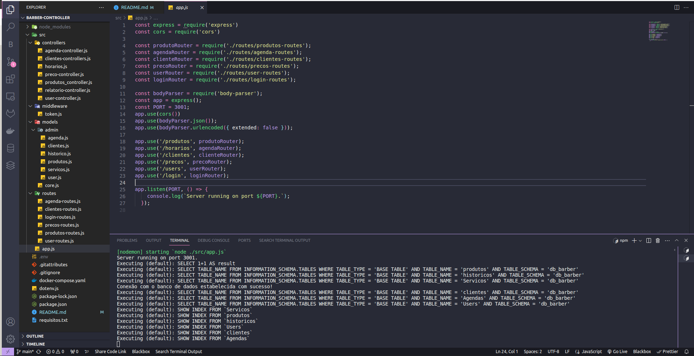

# Barber-Controller  

    Este projeto tem por objetivo criar uma API para controle de estoque, agendamentos e relatórios de faturamento mensal ou por periodo especificado de uma barbearia.  

## API utilizando Node.js  

## DATABASE:

*MySQL*

## FRAMEWORK:

*Docker Compose*  
*Express*  
*Sequelize*  

### Para rodar o código:  

- Faça o fork desse repositório para o seu GitHub  
- Clone o repositório em sua máquina  

### Passos para executar o codigo:

-criar arquivo .env na raiz com as seguintes informações:

MYSQL_DATABASE="db_barber"  
MYSQL_USER="user"  
MYSQL_PASSWORD="password"  
MYSQL_ROOT_PASSWORD="password"  
MYSQL_PORT= 3306  
ADMINER_PORT= 8080  

-abrir um terminal na pasta SRC e executar o comando:

```npm install```   

```docker compose up```

-abrir novo terminal na pasta SRC e executar o comando:

```npm start```

### Para testar as Rotas:

-arquivo json dentro da pasta insomnia

### Estrutura de pastas e exemplo do codigo:  





### Exemplos de uso das rotas: